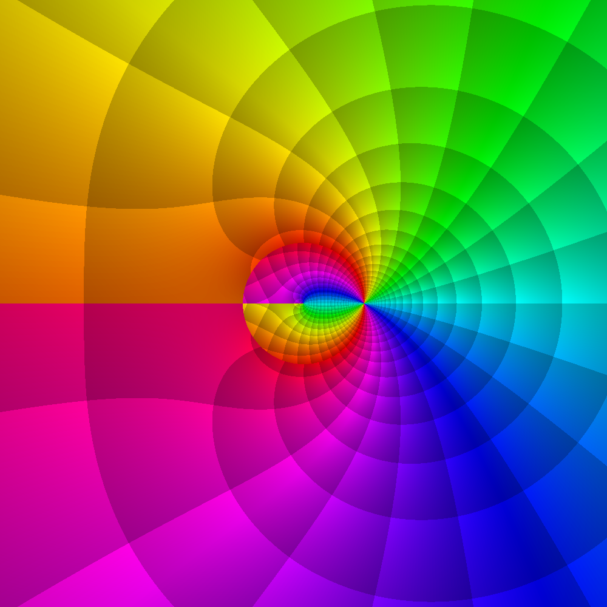
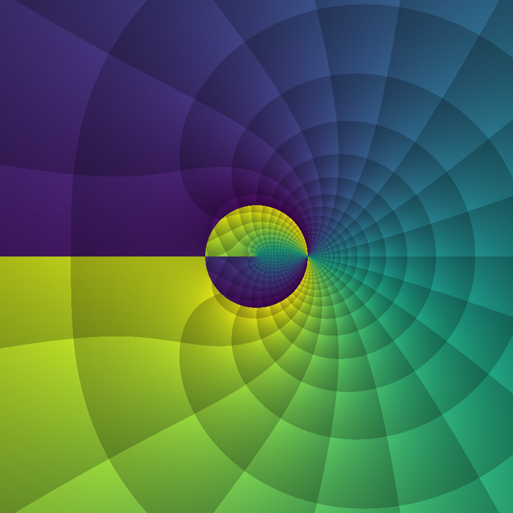
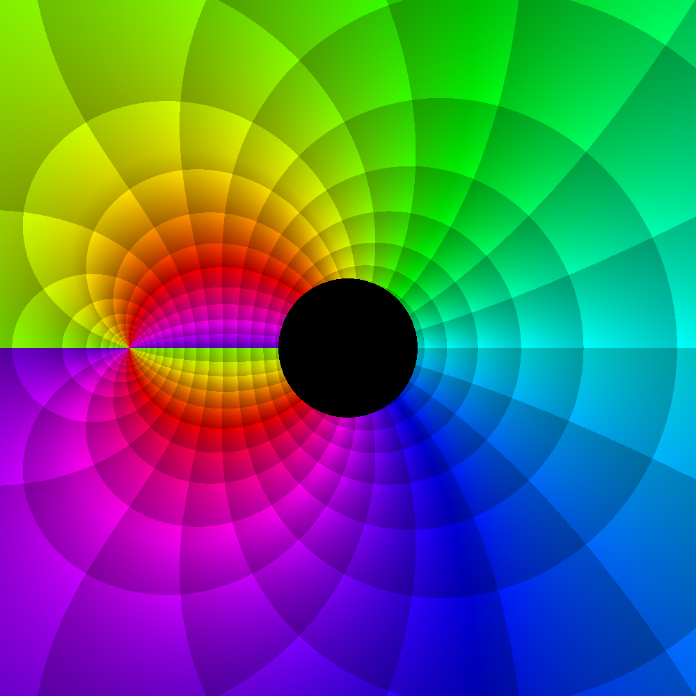
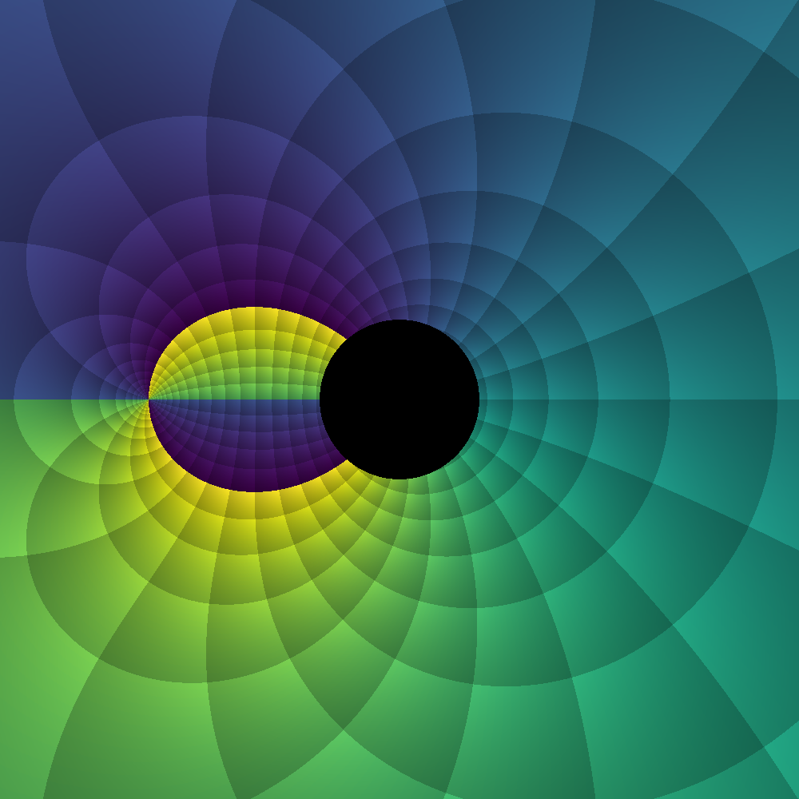
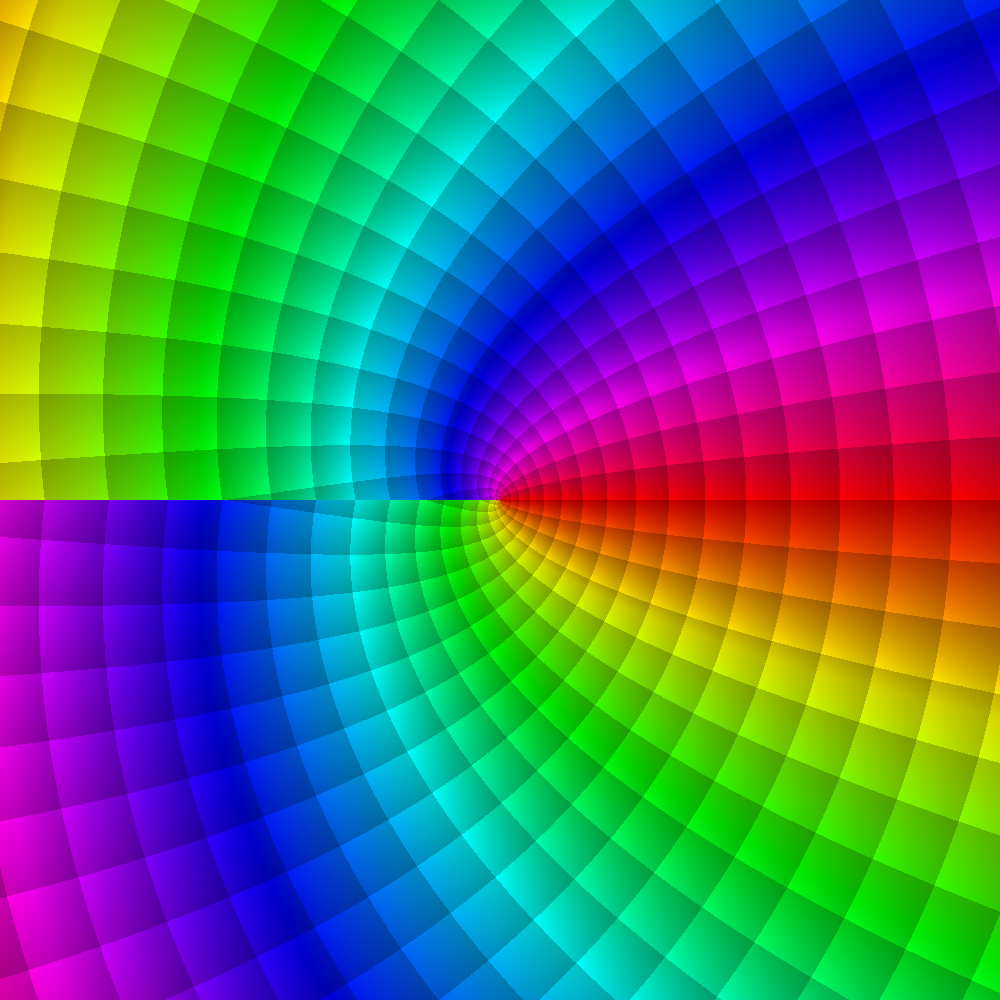
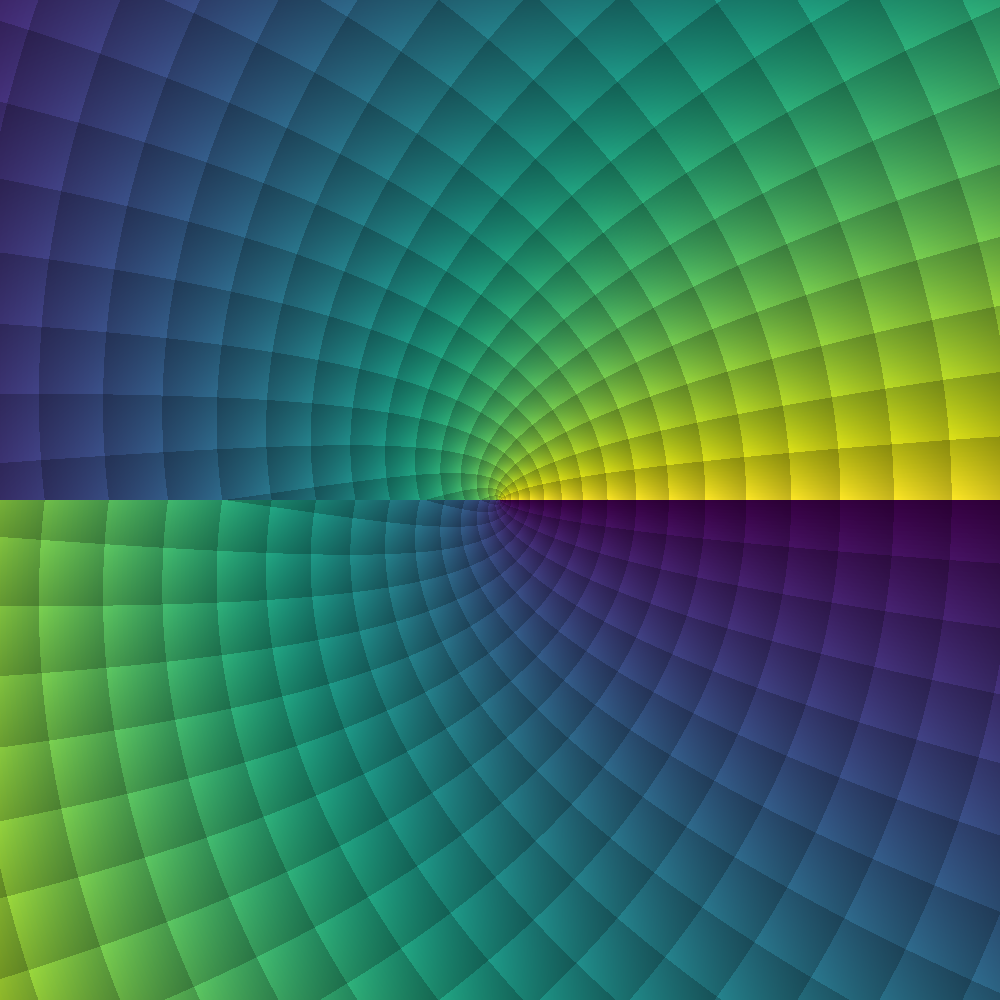
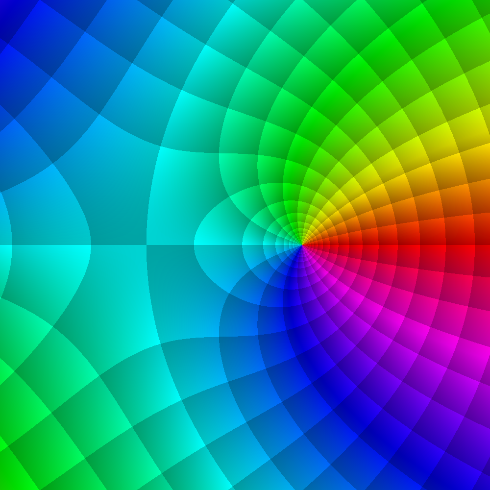
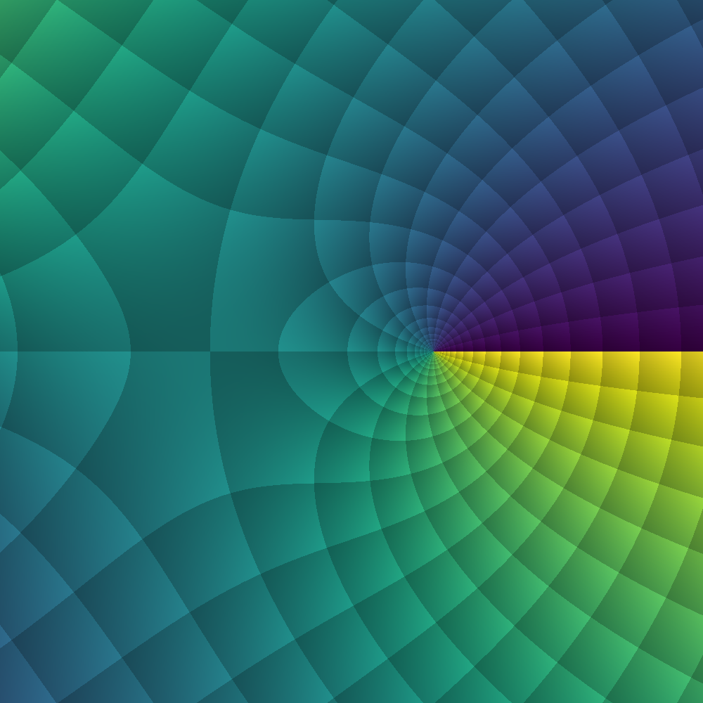

# Visual Examples

This page collects some nice looking complex phase portraits of Meijer-G functions (see `demos/complexphaseportraits.jl`).

To learn more about phase portraits and their usefulness, see [ComplexPhasePortrait.jl](https://github.com/JuliaHolomorphic/ComplexPhasePortrait.jl).

## Non-reducible example

Complex phase portrait of non-reducible $G_{3,3}^{2,1}\left( z\;\middle|\; \frac{1}{7},\frac{2}{7},\frac{4}{7} ; \frac{3}{7},\frac{5}{7},\frac{6}{7}\right)$:

|  |  |
|---:|:---|
| **NIST Standard** | **Viridis** |

## Confluent example

Complex phase portrait of confluent-parameter
$G_{4,4}^{2,1}\left( z\;\middle|\; \frac{1}{2},\frac{1}{2},-\frac{1}{4},3 ; 0,\frac{1}{2},5,-\frac{3}{2}\right)$:

|  |  |
|---:|:---|
| **NIST Standard** | **Viridis** |

## Bessel-related example

Complex phase portrait of Bessel-related
$G_{0,2}^{2,0}\left( z\;\middle|\; - ; 0,0\right)$:

|  |  |
|---:|:---|
| **NIST Standard** | **Viridis** |

## Asymmetric-parameter example

Complex phase portrait of asymmetric-parameter
$G_{1,3}^{1,0}\left( z\;\middle|\; \frac{1}{4} ; 0,-2.2,\frac{7}{5}\right)$:

|  |  |
|---:|:---|
| **NIST Standard** | **Viridis** |
